# Cyberloom — Master Specification

**Version 1.0 · approved reference specification · 4 September 2026**

Cyberloom is a desktop application for building programs by dragging
typed blocks onto a canvas and wiring them together. A block is a model, a
runtime, a sense, a memory store, an actuator, a control structure, or a
piece of your own code. A wire is a typed connection. A graph runs once,
runs live against a stream of events, or runs on a schedule.

This document consolidates every decision made across the design sessions
into one specification. It was approved on 4 September 2026 and is the
reference for implementation; changes from here are versioned, and
`docs/PLAN.md` is the build plan derived from it. The visual mockups it describes live on the design
canvas at <https://claude.ai/code/artifact/54c656f3-a5fe-47db-b858-e7b3794ee92e>
and as working files under `design/cyberloom/`. Where this document and
a mockup disagree, this document wins; §14 lists the places that happened
and what was changed.

## Contents

1. Purpose and principles
2. The shell
3. Blocks
4. Ports and types
5. Wires
6. The library
7. The inspector
8. Running a graph
9. Bundling: Toolbox and Memory hub
10. Custom blocks
11. Presence: the Avatar
12. Control, warnings and privacy
13. Worked examples
14. Consistency review
15. Decisions and backlog
16. Appendix: tokens, dimensions, figures, files

---

## 1. Purpose and principles

### 1.1 What it is

A single-user, local-first environment for composing AI programs out of
blocks. The user owns the machine, the models, the tools and the data. The
first target is a personal assistant that can see, hear, remember, speak,
show a face, print its thoughts and move things — but the same shell
builds a five-block ticket-triage script.

### 1.2 Who it is for

One person, on their own hardware, who wants complete control over what
their program can do. Not a team tool in v1; not a hosted service.

### 1.3 Principles

These are the decisions everything else follows from. Each was made
explicitly in review.

1. **Typed ports are the grammar.** Every block declares typed ports. A
   wire is coloured by its data type, and the type is what makes a
   connection legal or refuses it mid-drag. There is no untyped wire.
2. **The inspector is the state of the canvas.** The right panel has no
   identity of its own: nothing selected shows graph settings, a block
   shows that block, a wire shows that wire, three blocks show what they
   share. Same 328 px column, different contents.
3. **Bundle by pattern.** A Toolbox takes any number of `tools` inputs and
   exposes one `tools` output; a Memory hub does the same for `memory`.
   Direct wiring is also legal for the simple case. The two hubs are the
   same shape on purpose.
4. **Handles are two-way; flows are one-way.** `tools` and `memory` wires
   are handles: the holder calls, the device replies on the same call.
   Anything a device reports on its own initiative leaves on a separate
   port — `stream` or `data` for telemetry, `exec` for a fault.
5. **Warn, never block.** The user owns their tools. A truly dangerous
   action gets a warning prompt, and the prompt always has *Continue*.
   There is no approval gate, no admin lock, nothing a graph cannot do.
6. **Local by default.** Frames and audio never leave the machine and are
   never stored. Faces are stored as embeddings, never images. The
   orchestrator never sees raw sensor data, only what specialist models
   report.
7. **A graph with a source never finishes.** Sources (webcam, microphone,
   watch folder, webhook, schedule) keep the graph armed; every event runs
   downstream. The transport says how the graph runs; sources and loops
   say when.
8. **The code is one view of a block, not the block.** A custom block is a
   function whose signature is its interface. It shows as compact,
   summary or code; a big program lives in the drawer, not in a big block.
   The same holds for a block with a picture: compact, summary or stage
   (§3.4). What a block *is* never changes with how big it is drawn.
9. **Presence is a block.** The assistant's face is an actuator like any
   other: a rig declares the expressions it supports, the model may call
   only those, and timing comes from the wires, not from the model.

---

## 2. The shell

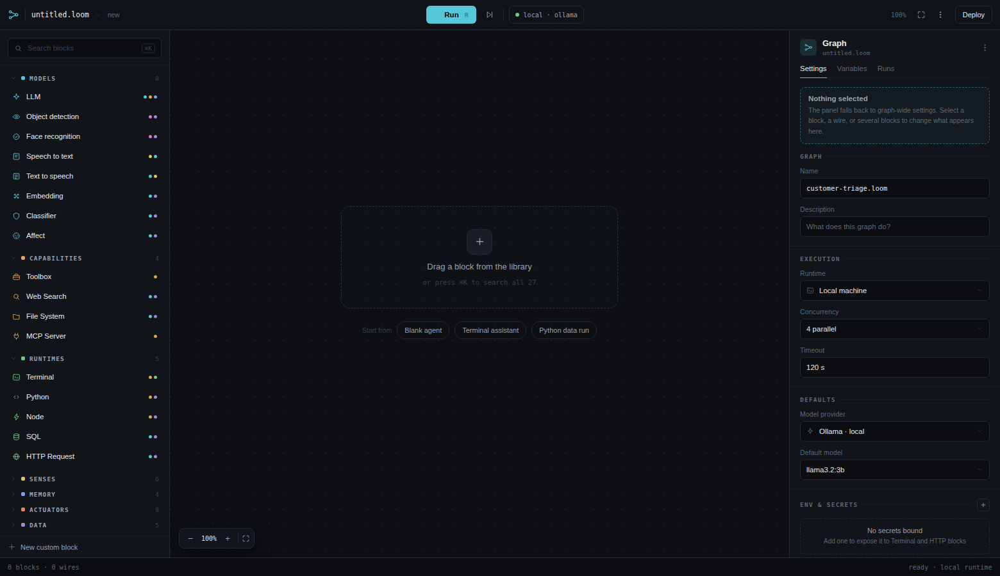

### 2.1 Regions

| Region | Size | Contents |
| --- | --- | --- |
| Top bar | 46 px | Logo mark, graph name with save state, transport (Run / running / live / next in / paused), step, runtime chip, zoom, fit, overflow, Deploy |
| Library | 264 px, collapsible to a 48 px icon rail | Search, categories, block rows, "New custom block" |
| Canvas | remaining width | Infinite pan/zoom surface on a 22 px dot grid; blocks, wires, loop frames; zoom pill bottom-left; minimap bottom-right |
| Inspector | 328 px | Adaptive panel (§7) |
| Status bar | 28 px | Left: block, wire and loop counts, drag hints. Right: runtime, run stats, warnings |
| Drawer | 176 px (console) · 300 px (code) | Slides up under the canvas: Console, Trace, Variables, and one tab per open custom-block file |

Reference frame is 1560 × 900. At 1920 × 1080 with the library collapsed
to the rail the canvas is 1544 × 1006 (Figure 9).

### 2.2 Top bar

The transport is the only coloured control on the bar and it names the
run mode (§8.1). The runtime chip shows what will execute the graph
(`local · ollama`, `local · ollama + cuda`) with a green dot when it is
reachable. Zoom is a percentage; *fit* frames all blocks.

*Deploy* has two forms: run the graph headless as a service, and export
the graph with its blocks as a standalone bundle (§15.1). Neither has a
screen yet; both are backlog. The engine is built as a separate process
from the start so the first form is the engine without the shell.

### 2.3 Library panel

Search field with `⌘K`. Categories are collapsible headers with a colour
swatch, an uppercase mono label and a count. Block rows show the
category-coloured icon, the name, and on the right a row of small dots for
the port types the block carries. A block already on the canvas shows an
*on canvas* chip instead of the dots. The footer is *New custom block*.

The panel collapses to a 48 px rail of category icons when space is
short; the rail keeps search at the top and an expand chevron at the
bottom.

### 2.4 Canvas

Dot grid at 22 px. Blocks snap loosely to the grid on drop. Selection is a
1 px accent ring with a 5 px soft outer glow. The minimap shows every
block as a category-coloured rectangle and the viewport as an accent
outline.

Gestures:

| Gesture | Effect |
| --- | --- |
| Drag from library | Places the block at the drop point; the library row becomes *on canvas* |
| Drag a port | Starts a wire (§5.2) |
| Click a block | Selects it; inspector shows it |
| Click empty canvas | Deselects; inspector shows graph |
| Double-click a block header | Cycles compact → summary → the block's third view, Code or Stage (§3.4) |
| Drag a block header | Moves it |
| Drag the corner grip | Resizes the block (§3.4) |
| Shift-click / marquee | Multi-select; inspector shows shared settings |
| `esc` during a drag | Cancels the drag |

### 2.5 Keyboard

| Key | Action |
| --- | --- |
| `R` | Run (or start live) |
| `⌘K` | Search blocks |
| `⌘E` | Open the selected block's third view: Code for a custom block, Stage for a visual one (§3.4) |
| `⌘G` | Collapse the selection into a subgraph |
| `esc` | Cancel drag; stop editing |

---

## 3. Blocks

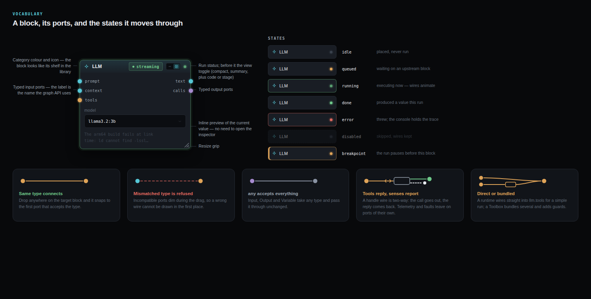

### 3.1 Anatomy

A block is a rounded card (9 px radius) with a 31 px header, a port zone,
a body, and a resize grip. In Stage view (§3.4) the header is a 24 px strip
and the body is the picture.

- **Header.** Category-coloured icon, title in Space Grotesk 600 at 12 px,
  a gradient tint of the category colour, optional badge chips on the
  right, the view toggle (§3.4, shown while hovered or selected), and the
  status dot last. A custom block adds its language chip (`py`, `ts`,
  `sh`); an Avatar adds its rig chip.
- **Port zone.** One row per port index, 24 px tall, inputs down the left
  edge and outputs down the right. The dot of row *i* is centred
  51 + 24·*i* px from the block's top; this is what the wire router uses.
  Port dots are 11 px, coloured by type, with a 3 px halo. Labels are
  JetBrains Mono 9.5 px. The port zone comes before the body so labels
  never overlay content.
- **Body.** Whatever the block wants to show inline: a field, a preview of
  its current value, a level meter, a list of bundled functions. The body
  is a *preview*, not the settings; settings live in the inspector.
- **Grip.** A 12 px diagonal grip in the bottom-right corner, shown while
  hovered or selected. Dragging it resizes the block (§3.4).

Minimum width is 168 px; content sets the rest. Widths on the mockups run
168–480 px.

### 3.2 Status dot and states

| State | Dot | Border | Meaning |
| --- | --- | --- | --- |
| idle | faint grey | normal | placed, never run |
| queued | amber | normal | waiting on an upstream block |
| running | green, breathing | soft green ring | executing now; its wires animate |
| done | green | normal | produced a value this run |
| error | red | red | threw; the console holds the trace |
| disabled | faint, 45 % opacity | dashed | skipped, wires kept |
| breakpoint | amber | 3 px amber left bar | the run pauses before this block |

A running block also shows its live figures inline (tokens and rate for an
LLM, exit code for a terminal, a progress hairline).

### 3.3 Badges

Chips in the header are for state that matters at a glance: `streaming`,
`42 lines`, `listening`, `3/min`, `armed`, `warns`, `2 fns`, a language
chip on a custom block, a rig chip on an Avatar. Chips are mono 9.5 px on a 12 % tint of their colour. Selection is
*never* a chip; it is the ring.

### 3.4 Views and resizing

Every block has Compact and Summary. Custom blocks add Code; blocks with a
live picture add Stage. Views are switched from a toggle in the header
(two or three positions accordingly), by double-clicking the header, or
with `⌘E` for the third. The toggle and the resize grip are shown while a
block is hovered or selected, so an unselected graph stays quiet. The view
is remembered per block, per graph.

| View | Shows | Third view depends on the block |
| --- | --- | --- |
| Compact | Name and ports | |
| Summary | Ports plus a preview: a field, a thumbnail, the current state | |
| Code | The inline editor | Custom blocks (§10.6) |
| Stage | The picture fills the block; the header shrinks to a 24 px strip; port labels hide and only the dots stay on the edges | Blocks with a live picture: Avatar, Webcam, Display, Terminal, Object detection |

Switching views never moves a port: the dot for row *i* stays at
51 + 24·*i* px from the block's top in every view, so wires do not move
when a block changes shape.

**Resizing.** Every block has a grip in its bottom-right corner. In Summary
view dragging it sets width and the body reflows. In Stage or Code view it
sets width and height; a picture scales, code scrolls. Sizes snap to the
22 px grid, the minimum is the compact size, and the size is remembered per
block per graph. An Avatar keeps its rig's aspect ratio unless the lock in
its inspector is turned off.

### 3.5 Loop frames

A Loop is not a block but a dashed frame on the canvas (slate,
1.5 px dashed, 12 px radius). Its header carries the loop icon, *For each*,
`as item`, and chips for iteration (`3 / 7`), queue depth and parallelism.
Blocks inside repeat once per item. The frame has an `items` input port on
its left edge; `results` (data), `done` (exec) and `errors` (data) outputs
are declared but hidden until wired (§4.5). A status line at the bottom of
the frame shows the current iteration and item.

---

## 4. Ports and types

### 4.1 The ten types

| Type | Colour | Carries | Accepted by |
| --- | --- | --- | --- |
| `text` | `#56c7d6` cyan | prompts, stdout, any string | `text`, `any` |
| `tools` | `#e0a458` amber | one callable, or a bundle of them | `llm.tools`, Toolbox inputs |
| `memory` | `#7e9ff0` blue | a store the model reads and writes | `llm.memory`, Memory hub inputs |
| `data` | `#a78bd0` violet | structured json or a record | `data`, `any` |
| `stream` | `#6fc98a` green | output arriving incrementally | `text`, `data` |
| `image` | `#d77bd0` magenta | frames from a camera or a file | `image`, `any` |
| `audio` | `#dcc65b` yellow | samples from a microphone | `audio`, `any` |
| `file` | `#7f93c9` slate-blue | a path or blob on disk | `file`, `any` |
| `exec` | `#e8ebf0` white | a trigger or control flow, never a value | `exec` |
| `any` | `#8a93a3` grey | accepts every type | everything |

A wire is legal when its source type is accepted by the target port. That
is the whole rule; there is no implicit cast. An explicit transform can be
inserted on a wire (§5.4).

### 4.2 Fan-in and fan-out

An output port may feed any number of inputs. An input port may accept
any number of wires of a compatible type; the block decides how to combine
them (an LLM concatenates `context`, a Toolbox lists each `tools` input as a
slot, a Notify block fires on any `send`).

### 4.3 Handles versus flows

`tools` and `memory` wires are **handles**. The holder — an LLM, a Toolbox,
a Memory hub — makes calls; the device replies on the same call. The wire's
direction says who holds the handle, not which way traffic goes. Handle
wires are drawn slightly heavier (2.2 px against 1.9 px) and carry a small
`‹›` mark at the holder's end.

Every other type is a **flow**: one direction, one producer, values
arriving as they are produced.

### 4.4 Feedback shapes

A device that can be commanded can also report. Three shapes, told apart by
port type:

| Shape | Port | Who initiates | Example |
| --- | --- | --- | --- |
| Reply | `tools` / `memory` | the holder | `motor.move()` returns "stalled at −31°" |
| Telemetry | `stream` / `data` output | the device, continuously | encoder position, temperature, load; the Avatar's `state` (expression, speaking, gaze) |
| Interrupt | `exec` output | the device, on an event | collision, limit reached, device unplugged |

The Motors block on the assistant example carries all three (`tool`,
`state`, `fault`). The interrupt path is the reflex path: a `fault` wired
to a Toolbox's `pause` input stops tool calls before the orchestrator has
finished its next thought.

### 4.5 Optional ports and visibility

Every block has a canonical port set (§6). Ports that are optional and
unwired are hidden in every view to keep blocks small (in Stage view even
wired ports show as dots without labels, §3.4). They
appear the moment a compatible wire drag begins, so they can be targeted,
and on the block's *Ports* tab in the inspector. The LLM's canonical set,
for instance, is `trigger`, `prompt`, `context`, `tools`, `memory` in and
`text`, `thoughts`, `calls` out; the examples show only the ports each
example uses.

---

## 5. Wires


### 5.1 Drawing

A wire is a cubic bezier from the source dot to the target dot with
horizontal tangents. The control-point offset is
`max(48, 0.55·|Δx|, 0.22·|Δy|)`, which keeps short vertical hops from
kinking. Each wire is drawn twice: a 5 px halo at 9 % opacity and a 1.9 px
core (2.2 px for handles). Colour is the source port's type.

### 5.2 Dragging

1. Drag from any port. The wire follows the pointer, dashed and glowing in
   the port's colour.
2. Every port on the canvas that cannot accept the type dims to 30 %.
   Every port that can, stays lit; the one under the pointer glows with a
   4 px ring, and a snap ring appears when the pointer is within 16 px.
3. A tooltip beside the pointer names the connection
   (`toolbox.tools → llm.tools`). The status bar reads *release to connect —
   esc cancels*.
4. Dropping anywhere on a target block snaps to the first port that
   accepts the type. Dropping on empty canvas cancels.

### 5.3 Live wires

While a run is in flight, wires that carried a value in the last event
animate a flowing dash in their type colour. Wires not yet reached are
drawn at 28 % opacity with a short dash. This is how the shape of a run
reads without opening the console.

### 5.4 Wire inspector

Selecting a wire shows: the two endpoints as block rows, the type chip
and a compatibility note (*exact match — no cast needed*), a *Watch value*
toggle that shows the last payload, and *Insert block* / *Delete* actions.
There is no transform on a wire: a wire either matches or it does not
(§4.1), and a conversion is a visible block inserted on the wire (a
*Convert* block from the Data category, §15.5). The *Transform* field on
Figure 5 is superseded.

---

## 6. The library

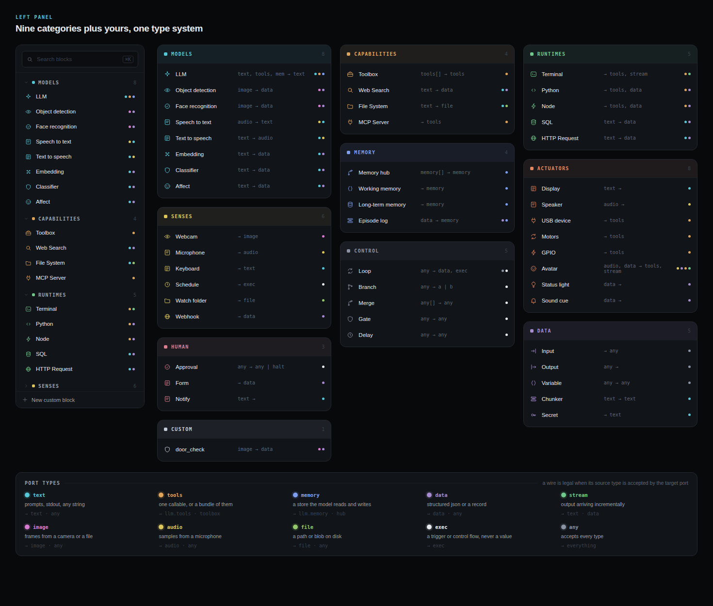

Nine categories plus Custom. Each category has a colour shared between its
shelf in the library and the header of every block in it. Blocks with a
live picture — Webcam, Object detection, Display, Terminal, Avatar — have a
Stage view (§3.4); custom blocks have a Code view (§10.6).

### 6.1 Models — cyan `#56c7d6`

| Block | Ports | Notes |
| --- | --- | --- |
| LLM | in `trigger` exec, `prompt` text, `context` data/text, `tools`, `memory` · out `text`, `thoughts` text, `calls` data | Any local or remote chat model. `thoughts` is a separate stream from `text` so reasoning can go to a terminal without reaching the display. Role setting: assistant, orchestrator, classifier. |
| Object detection | in `image` · out `objects` data | e.g. yolo-v8n; labels, confidences, boxes |
| Face recognition | in `image` · out `person` data | Embeddings only, never images; enrolment is off by default |
| Speech to text | in `audio` · out `text` | Streaming, with a lag figure |
| Text to speech | in `text` · out `audio` | |
| Embedding | in `text` · out `data` | |
| Classifier | in `text` · out `data` | A label with a confidence |
| Affect | in `text` · out `affect` data | Valence and arousal read from a stream of text; feeds an Avatar's `express` port so a smile costs no tool call |

### 6.2 Capabilities — amber `#e0a458`

| Block | Ports | Notes |
| --- | --- | --- |
| Toolbox | in `tools` × n, `pause` exec · out `tools` | One input slot per connected tool plus an empty slot. §9.1 |
| Web Search | in `text` · out `data` | |
| File System | in `text` · out `file` | |
| MCP Server | out `tools` | Exposes an MCP server's tools as one bundle |

### 6.3 Runtimes — green `#6fc98a`

| Block | Ports | Notes |
| --- | --- | --- |
| Terminal | out `tool` tools, `stdout` stream | Runs a command; offered to a model as `terminal.run` |
| Python | out `tool` tools, `value` data | `python.exec` |
| Node | out `tool` tools, `value` data | |
| SQL | in `text` · out `data` | |
| HTTP Request | in `text` · out `data` | |

A runtime's `tool` port wires straight into `llm.tools` for a simple run, or
into a Toolbox to be bundled with others.

### 6.4 Senses — yellow `#dcc65b`

A block in this category is a **source**: it emits on its own initiative
and keeps the graph armed (§8).

| Block | Ports | Notes |
| --- | --- | --- |
| Webcam | out `frames` image | Device, resolution, frame rate; downstream blocks sample |
| Microphone | out `audio` | Level meter and voice-activity state inline |
| Keyboard | out `text` | A line of typed input |
| Schedule | out `tick` exec | Every / cron / once at; jitter; catch-up policy |
| Watch folder | out `file` | Path, pattern, events, debounce |
| Webhook | out `event` data | Method, path, port |

### 6.5 Memory — blue `#7e9ff0`

| Block | Ports | Notes |
| --- | --- | --- |
| Memory hub | in `memory` × n · out `memory` | Recall order, consolidation, retention. §9.2 |
| Working memory | out `memory` | In-process, fast, windowed (e.g. 128 items · 5 min) |
| Long-term memory | out `memory` | SQLite + vectors; people, places, episodes |
| Episode log | in `data` · out `memory` | Append-only record of what happened |

### 6.6 Actuators — orange `#e8865a`

| Block | Ports | Notes |
| --- | --- | --- |
| Display | in `text` | A screen or overlay |
| Speaker | in `audio` | |
| USB device | out `tool` tools, `read` stream | Serial device; `usb.send`, `usb.read` |
| Motors | out `tool` tools, `state` stream, `fault` exec | Servo controller; `motor.move`, `motor.home`; limits and warn-before-move |
| GPIO | out `tool` tools, `pins` stream | |
| Avatar | in `speech` audio, `express` data, `look` data · out `tool` tools, `state` stream | The assistant's presence. §11 |
| Status light | in `express` data · out `tool` tools | A lamp or LED that breathes a colour on the same vocabulary |
| Sound cue | in `express` data · out `tool` tools | A chime per expression |

### 6.7 Data — violet `#a78bd0`

| Block | Ports |
| --- | --- |
| Input | out `any` — the graph's entry value |
| Output | in `any` — a named result |
| Variable | in `any` · out `any` |
| Chunker | in `text` · out `text` |
| Secret | out `text` — bound from the graph's env |

### 6.8 Control — slate `#8a93a3`

| Block | Ports | Notes |
| --- | --- | --- |
| Loop | in `items` any · out `results` data, `done` exec, `errors` data | A frame, not a card. §3.4 |
| Branch | in `any` · out `a`, `b` exec | Condition on the input |
| Merge | in `any` × n · out `any` | |
| Gate | in `any`, `open` exec · out `any` | |
| Delay | in `any` · out `any` | |

### 6.9 Human — rose `#d97f8f`

| Block | Ports | Notes |
| --- | --- | --- |
| Approval | in `any` · out `any`, `halt` exec | A human step the *user* chooses to place. Consistent with §12: it is not imposed. |
| Form | out `data` | |
| Notify | in `send` exec, `text` | Slack, email, desktop |

### 6.10 Custom — pale `#c3ccd8`

Blocks the user has written and saved (§10). A custom block can also
declare a category in its decorator and then sits on that shelf instead.

---

## 7. The inspector

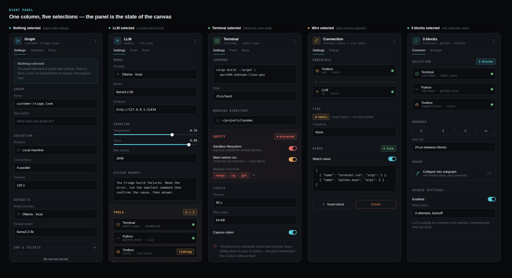

### 7.1 The rule

The inspector shows the settings of whatever is selected. It has no home
state of its own.

| Selection | Panel |
| --- | --- |
| Nothing | Graph: name, description, runtime, concurrency, timeout, default model, env & secrets, run mode (§8) |
| One block | That block's settings, led by the boundary that matters most for that block |
| One wire | Endpoints, type, transform, watch value |
| Several blocks | Only what they share: enabled, retry policy; arrange and group actions |
| During a run | The Run panel: progress per block, live output, usage, pause/stop |

### 7.2 Header and tabs

Every panel opens with the block's icon on a category tint, its title, and
a mono subtitle giving category and kind (`models · llm.chat`). Tabs are
standard:

- Blocks: **Settings · Ports · Runs**
- Sources: **Settings · Ports · Events**
- Graph: **Settings · Variables · Runs**
- Wire: **Settings · Debug**
- Multi-select: **Common · Arrange**
- A block type may append one tab of its own: *Source* and *Tests* for a
  custom block, *People* for face recognition, *Browse* for the memory hub,
  *Rigs* for the Avatar.

### 7.3 Sections

Settings are grouped under uppercase mono section labels with a hairline
rule. A section that carries a boundary (safety, privacy, physical limits)
is tinted and leads the panel. Controls: select fields, mono text fields,
sliders with the value on the right, toggles with a one-line hint,
connection rows (icon, name, meta, status dot), chip groups.

Every block with a third view has a **View** section: the view as a
segmented control, the size on canvas, and for an Avatar the aspect lock
(§3.4).

### 7.4 Panel catalogue

Panels drawn in the mockups, and what leads each:

| Block | Leads with | Then |
| --- | --- | --- |
| LLM | Model (provider, model, endpoint) | Sampling; System prompt; Tools (connected list, tool choice); for an orchestrator: Specialists, Memory, Thoughts |
| Terminal | Command and shell | Working directory; **Safety** (sandbox filesystem, warn before run, allowed commands); Limits |
| Toolbox | Exposed functions | Binding (presented to); Guards (confirm before call, log arguments) |
| Input | Value and type | Source (manual, prompt on run) |
| Watch folder | Source (path, pattern, events) | Rate (debounce, when busy, drop duplicates); Emits; Live |
| Schedule | Interval (every / cron / once at, jitter) | Catch-up; Emits; Next |
| Loop frame | Iterate (over, as, parallel, max) | Stop when; Ports; Live |
| Webcam | Device | Emits; **Privacy** (frames never leave, record to disk, retention); Live preview |
| Face recognition | Model and threshold | Known people; Emits; enrolment toggle; **Stored as** |
| Memory hub | Stores | Recall (order, max, cutoff); Consolidation; **What is kept** |
| Motors | Device | **Limits** (ranges, speed, warn before move); Exposes and reports; Live |
| Custom block | Source (inline / file, runtime) | **Interface** (parsed, live); Settings (generated); View; Library |
| Avatar | Rig (picker) | Vocabulary (generated from the rig); Inputs; Idle; View; Output; Live |
| Graph, live | **Run mode** | Sources armed; When events overlap; Between events; Recent events |

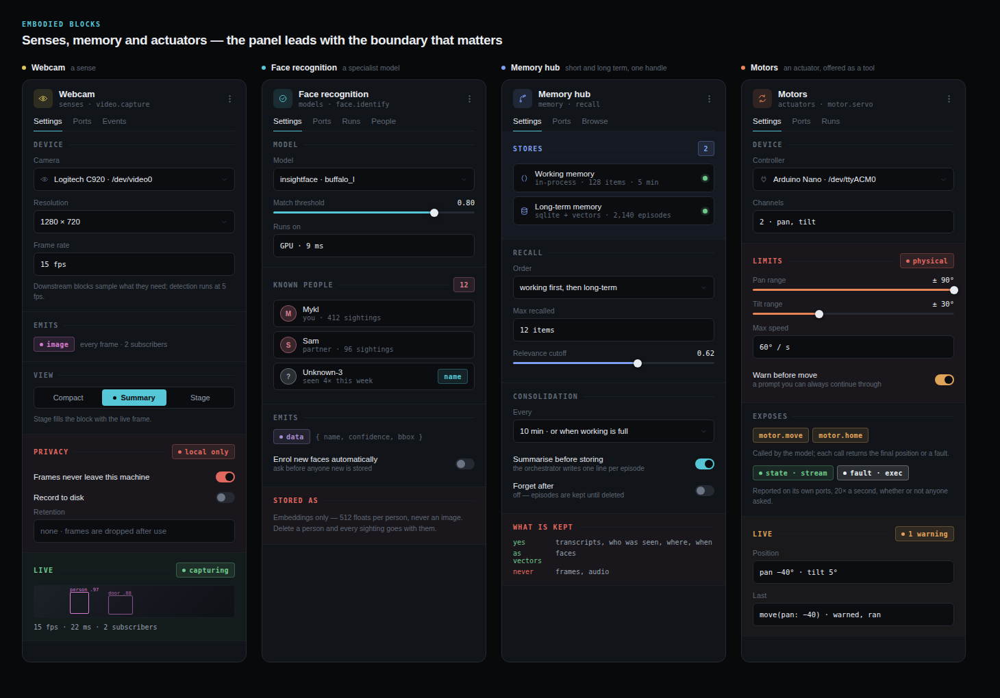

---

## 8. Running a graph

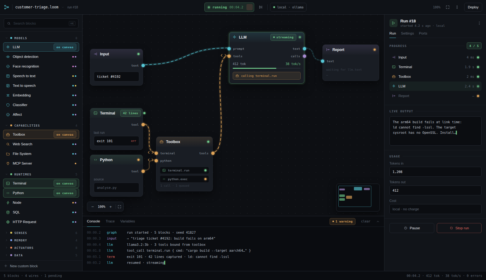

### 8.1 Run modes and the transport

| Mode | Transport reads | Behaviour |
| --- | --- | --- |
| Once | `▶ Run` → `● running 00:04.2 ■` | Runs the graph top to bottom, then stops. What every graph does until it has a source. |
| Live | `● live 4h 12m · 3.1/min ■` | Sources stay armed and every event runs downstream. Stop tears the whole graph down. |
| Schedule | `◷ next in 4:12 ■` | Only Schedule blocks are armed; between ticks the graph sleeps. |
| Paused | `❚❚ paused · queue 12 ▶` | Events keep queueing; nothing runs until resumed. For rewiring a live graph. |

The graph panel's Run mode section is a three-way segmented control
(Once · Live · Schedule). A graph with a source defaults to Live.

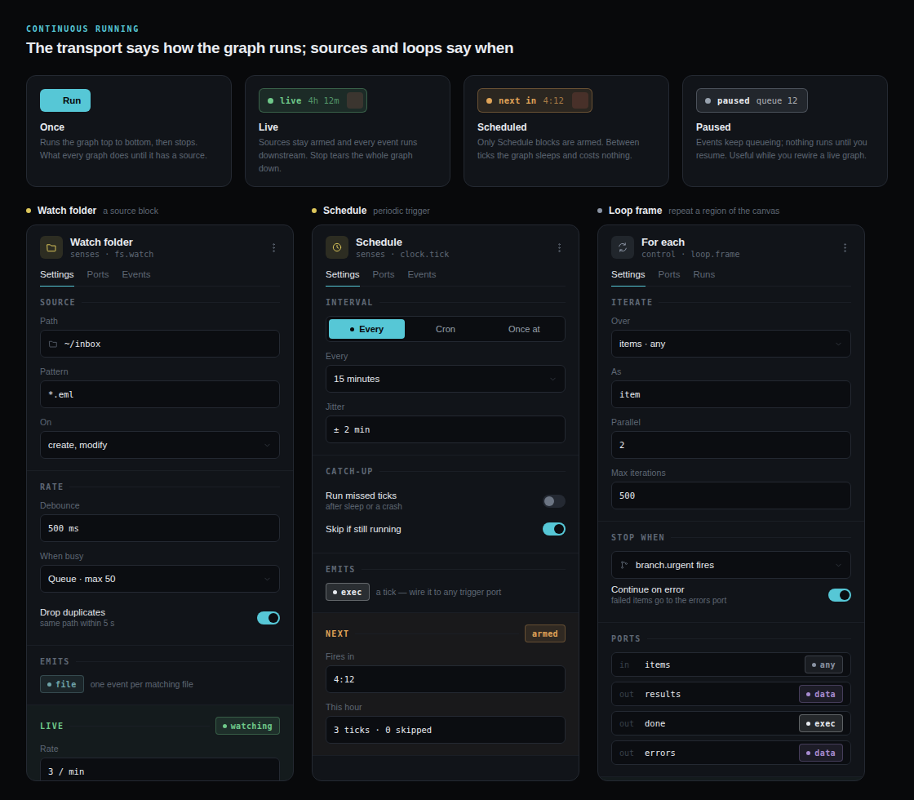

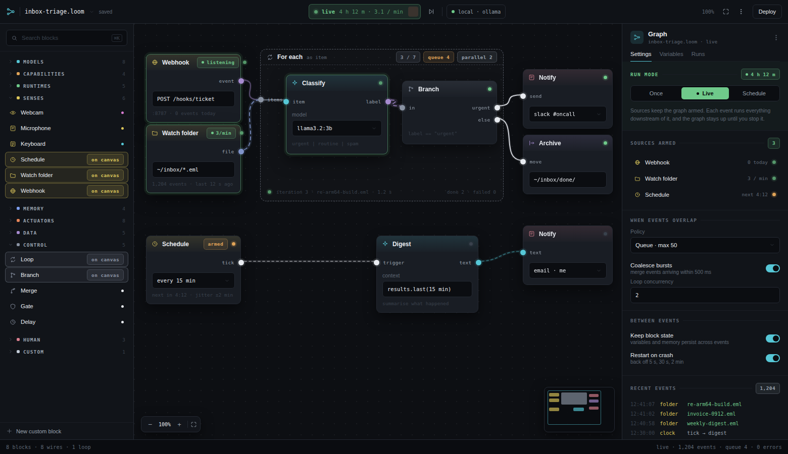

### 8.2 Sources

A source shows its rate as a header chip (`3/min`, `listening`, `armed`)
and its totals inline. The graph panel lists every armed source with its
state. Source settings always include a rate section: debounce, what to do
when busy, duplicate suppression.

### 8.3 When events overlap

| Setting | Options | Default |
| --- | --- | --- |
| Policy | Queue (max n) · Drop newest · Drop oldest · Coalesce | Queue · max 50 |
| Coalesce bursts | merge events within *n* ms | on, 500 ms |
| Loop concurrency | *n* items in parallel per loop frame | 2 |

### 8.4 Between events

| Setting | Default |
| --- | --- |
| Keep block state (variables and memory persist across events) | on |
| Restart on crash (back off 5 s, 30 s, 2 min) | on |

### 8.5 The Run panel

While a run is in flight the inspector shows: Progress (each block with
timing and status; the running one highlighted), Live output (the
orchestrator's streaming text), Usage (tokens in and out; cost, which is
*local · no charge* for local models), and Pause / Stop.

### 8.6 The console drawer

Tabs: **Console · Trace · Variables**, plus one tab per open custom-block
file. Console lines are `time · source · message`, with the source
coloured by category. Warnings are counted in a chip on the tab strip.

---

## 9. Bundling: Toolbox and Memory hub

### 9.1 Toolbox

- Inputs: one `tools` slot per connected block, plus an always-present
  empty slot; a `pause` input of type `exec`.
- Output: one `tools` handle.
- Body: the functions it exposes, one row per function, with a warning
  dot on any function that warns before running.
- Settings: which model it is presented to; describe from docstrings;
  guards (confirm before each call, log arguments).
- Pause: an `exec` on `pause` stops tool calls until the user resumes or a
  clearing call (`motor.home`) succeeds. It pauses; it never locks.

Direct wiring — a runtime or actuator `tool` port straight into
`llm.tools` — is legal and right for a simple run. The Toolbox is for
sharing guards and descriptions across several tools.

### 9.2 Memory hub

- Inputs: one `memory` slot per store.
- Output: one `memory` handle, presented to a model as `llm.memory`.
- Recall: order (working first, then long-term), max recalled items,
  relevance cutoff.
- Consolidation: every *n* minutes or when working memory is full;
  summarise before storing (the orchestrator writes one line per episode);
  forget-after (off by default).
- What is kept, shown explicitly in the panel: transcripts, who was seen,
  where and when — yes; faces — as vectors; frames and audio — never.

A model with a `memory` handle gets `remember()` and `forget()` as tools.

---

## 10. Custom blocks

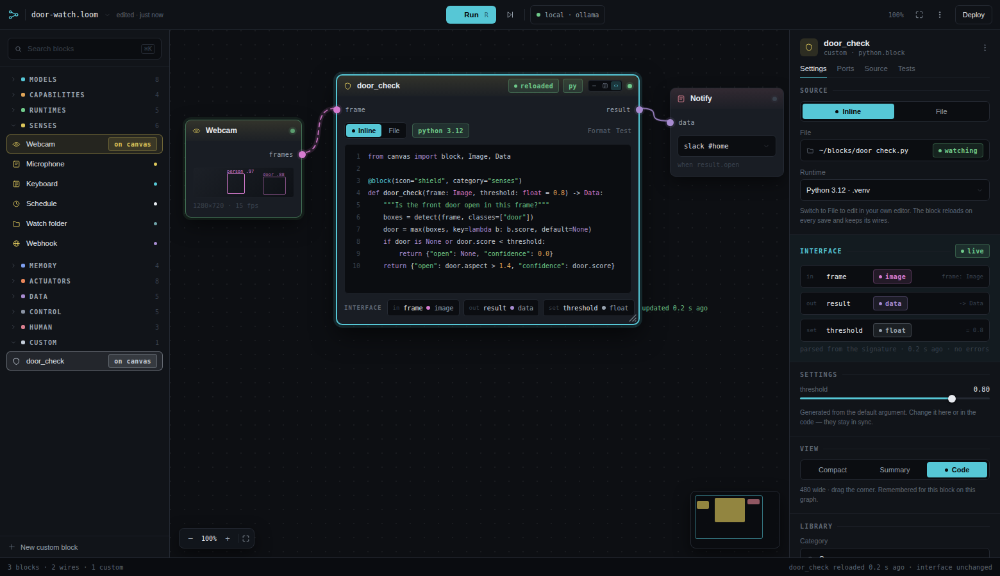

### 10.1 The signature is the block

A custom block is a function. Its signature is parsed live and becomes its
interface:

| In the code | On the block |
| --- | --- |
| `@block(icon="shield", category="senses")` | Name, icon, and which shelf it lands on |
| A parameter without a default (`frame: Image`) | An input port, typed by its annotation |
| A parameter with a default (`threshold: float = 0.8`) | A setting in the inspector, generated with the right control |
| The return annotation (`-> Data`) | The output port; a tuple makes several |
| The docstring | The description |

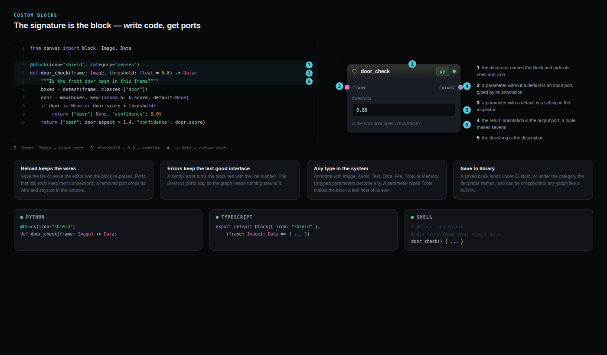

Annotations use the type system (§4.1): `Image`, `Audio`, `Text`, `Data`,
`File`, `Tools`, `Memory`. An untyped parameter becomes `any`. A parameter
typed `Tools` makes the block a tool host of its own; one typed `Memory`
gives it a memory handle. There is no gating on this (§12).

### 10.2 Source modes

- **Inline.** The code lives in the graph file and is edited in the block
  (code view) or in the drawer.
- **File.** The block points at a file and watches it. Edit anywhere; the
  block reloads on save. The inspector shows the path with a *watching*
  chip.

### 10.3 Reload rules

- Re-parse on save or when the editor loses focus.
- Ports that still exist keep their wires. A removed port drops its wire
  and says so in the console. A new port appears with a `+1 port` note in
  the interface section and the status bar.
- Settings and code stay in sync: changing a generated setting in the
  inspector rewrites the default in the code.

### 10.4 Error rules

A syntax or type error turns the block red with the line number. The
previous interface stays so the graph keeps running around it.

### 10.5 Languages

Python (`@block` decorator), TypeScript or plain JavaScript (`export
default block({...}, fn)`; the runtime strips types, so `.js` and `.ts`
are the same block kind), shell (`# @block`, `# @in`, `# @out` comments).
A file with several `@block` functions makes several blocks, one per
function. Compiled languages are backlog (§15.8).

### 10.6 Views

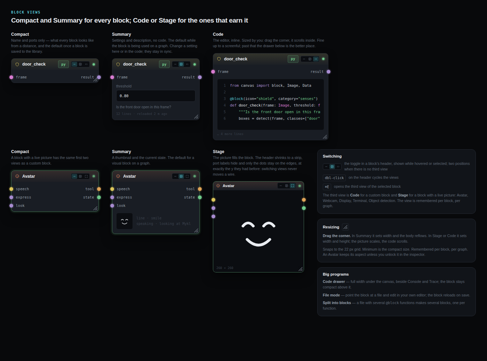

A custom block's third view is Code (§3.4 has the general rule).

| View | Shows | Default when |
| --- | --- | --- |
| Compact | Name and ports | Saved to the library and dropped onto another graph |
| Summary | Settings, description, line count and last reload | In use on the graph where it was written |
| Code | The inline editor, sized by the user; scrolls inside | Opened deliberately |

### 10.7 Big programs

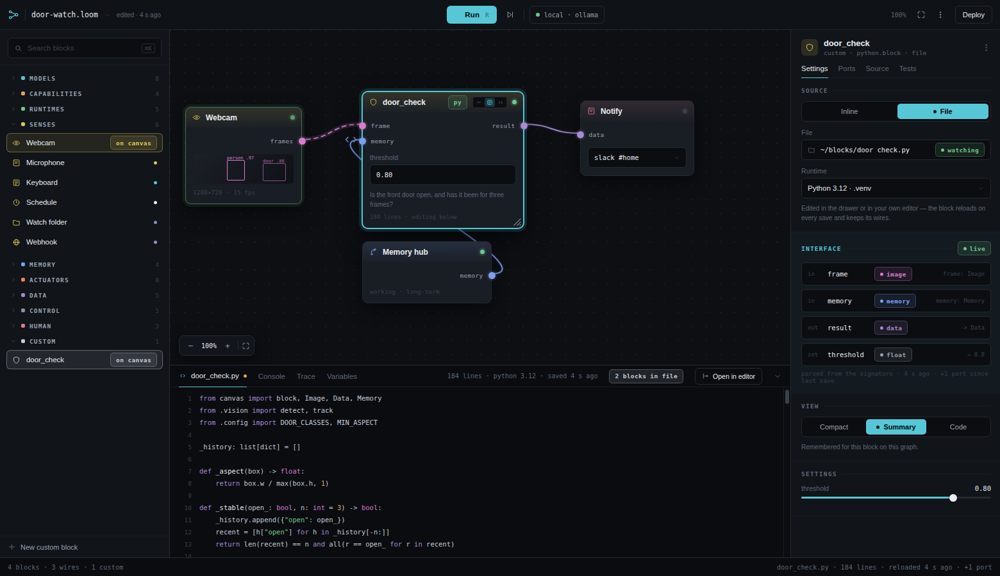

Past a screenful, the code leaves the block: the **code drawer** opens
under the canvas as a tab beside Console and Trace, full width, with an
*Open in editor* button; or **File mode** hands the file to the user's own
editor. Either way the block on the canvas stays summary-sized.

### 10.8 Save to library

Category and icon are editable in the inspector's Library section. *Save to
library* puts the block under Custom (or the category it names); *Export
.py* writes the file.

---

## 11. Presence: the Avatar

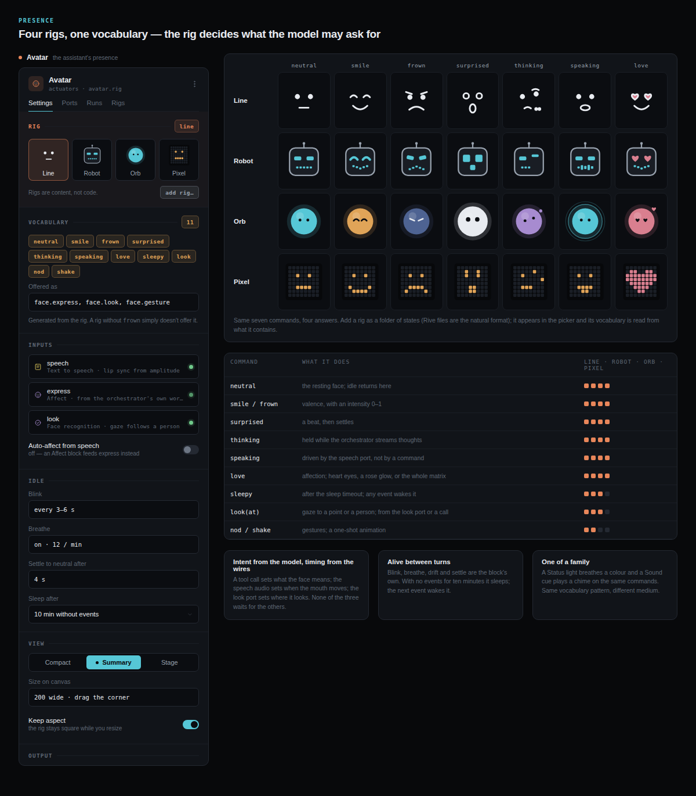

Everything else on the assistant graph gives it senses and hands. The
Avatar gives it a presence: something to look at, and read a mood from.

### 11.1 Rigs

A rig is one aesthetic plus the animations it supports. The reference
format is a folder of SVG states with a `rig.yaml` manifest naming the
expressions, gestures and idle parameters; Rive import is backlog
(§15.10). Four ship: **Line**
(two eyes and a mouth, nothing else), **Robot** (a head with LED eyes and a
segmented mouth), **Orb** (a sphere whose colour and glow carry the
expression), **Pixel** (an 8 × 8 LED matrix). Each ships the same seven
expressions and the gestures its form allows. A user adds a rig as a folder
of states; Rive files are the natural format because their state machines
take inputs directly. Rigs are content, not code: adding one is not a
custom block.

### 11.2 The vocabulary is generated from the rig

| Command | Behaviour | Line | Robot | Orb | Pixel |
| --- | --- | --- | --- | --- | --- |
| `neutral` | the resting face; idle returns here | ● | ● | ● | ● |
| `smile` / `frown` | valence, with an intensity 0–1 | ● | ● | ● | ● |
| `surprised` | a beat, then settles | ● | ● | ● | ● |
| `thinking` | held while the orchestrator streams thoughts | ● | ● | ● | ● |
| `speaking` | driven by the speech port, never by a command | ● | ● | ● | ● |
| `love` | affection: heart eyes on Line and Robot, a rose glow on Orb, the whole matrix on Pixel | ● | ● | ● | ● |
| `sleepy` | after the sleep timeout; any event wakes it | ● | ● | ● | |
| `look(at)` | gaze to a point or a person | ● | ● | ● | |
| `nod` / `shake` | one-shot gestures | ● | ● | | |

When a rig is chosen, the `face.express` tool's enum is generated from what
the rig contains. The model can only ask for expressions that exist. This
is the custom-block rule (§10.1) applied to animation: the interface is
derived, never typed by hand.

### 11.3 Ports

| Port | Type | Typically fed by | Drives |
| --- | --- | --- | --- |
| `tool` (out) | `tools` | Toolbox or `llm.tools` | `face.express(emotion, intensity)`, `face.look(at)`, `face.gesture(name)`; the model sets *intent* |
| `speech` | `audio` | Text to speech, fanned out alongside the Speaker | Mouth movement from the actual audio; lip sync never involves the model |
| `express` | `data` | An Affect model on the orchestrator's text, or a Branch | Expression as a flow, for graphs that should not spend a tool call on every smile |
| `look` | `data` | Face recognition `person` | Gaze follows whoever is in frame |
| `state` (out) | `stream` | | Current expression, speaking or idle, gaze target |

Intent from the model, timing from the wires: a tool call sets what the
face means, the speech audio sets when the mouth moves, the look port sets
where it looks. None of the three waits for the others.

### 11.4 Idle

Blink cadence, breathing, gaze drift and a settle-to-neutral timer are the
block's own, so the avatar is alive between turns. After a configurable
period with no events it sleeps; the next event wakes it.

### 11.5 Output

A window (optionally always on top), a specific screen, or a physical face:
the avatar can call `face.render` on a USB device block to drive an LED
matrix. The target is a setting, not a wire.

### 11.6 On the canvas

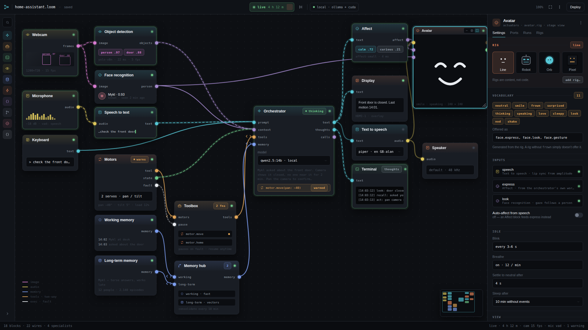

The Avatar's third view is Stage (§3.4). Its Summary view shows a
thumbnail of the rig and the current state; Stage fills the block with the
rig itself, resizable from the corner with the aspect locked by default.
On a busy graph Stage costs real canvas room, which is what the library
rail is for.

### 11.7 A family

The Avatar is one of a small family of expression actuators. A **Status
light** breathes a colour and a **Sound cue** plays a chime, each on the
same command vocabulary. Same pattern, different medium.

### 11.8 Warnings

`face.express` is not a physical action and does not warn.

## 12. Control, warnings and privacy

### 12.1 Warn, never block

The user owns their tools. The application may warn before a truly
dangerous action; it may not prevent one.

- A warning is a prompt with the action described and a *Continue*. It
  may also offer *Don't warn again for this block*.
- The toggles that raise warnings (*Warn before run* on Terminal, *Warn
  before move* on Motors, *Warn on physical actions* on an orchestrator)
  are the user's own preferences, off or on as they choose.
- Nothing in a panel enforces anything. The Terminal panel says so in its
  footnote.
- A hardware fault *pauses*; one click resumes.

### 12.2 What warrants a warning by default

- Running a shell command outside the allowed list.
- A physical action (motor move, GPIO write).
- Deleting a person from long-term memory.
- Enrolling a new face.
- Sending data to a remote model or service for the first time in a graph.

### 12.3 Privacy defaults

- Frames and audio never leave the machine and are not recorded unless
  the user turns recording on.
- Faces are stored as embeddings (512 floats per person), never images.
  Delete a person and every sighting goes with them.
- The orchestrator never receives raw frames or audio; it receives what
  specialist models report.
- Transcripts, sightings, places and times are kept in long-term memory;
  the memory hub panel states this plainly.
- Fetching a model is not the same as sending data out. Downloading
  weights on first run is allowed (§15.13); it tells the host which model
  was asked for and nothing else. Sending a prompt, a frame or a
  transcript to someone else's machine is what the Local only switch
  governs (§15.4), and that stays on by default.

---

## 13. Worked examples

### 13.1 Customer triage — a five-block run

Figures 3 and 7. The smallest complete program: an Input, an LLM, and two
runtimes offered to it through a Toolbox.

| Wire | From | To | Type |
| --- | --- | --- | --- |
| 1 | Input `text` | LLM `prompt` | text |
| 2 | Terminal `tool` | Toolbox slot 1 | tools |
| 3 | Python `tool` | Toolbox slot 2 | tools |
| 4 | Toolbox `tools` | LLM `tools` | tools (handle) |
| 5 | LLM `text` | Report `text` | text |

Run once. The LLM calls `terminal.run`, the terminal fails with exit 101,
the model reads the linker error and answers. Everything is visible on the
canvas as it happens: the live wire, the token rate on the LLM, the exit
code on the terminal, the console lines below.

### 13.2 Inbox triage — a live graph

Figure 8. The same idea that never finishes.

| Wire | From | To | Type |
| --- | --- | --- | --- |
| 1 | Webhook `event` | Loop `items` | data |
| 2 | Watch folder `file` | Loop `items` | file |
| 3 | Loop item | Classify `prompt` | any |
| 4 | Classify `label` | Branch `in` | data |
| 5 | Branch `urgent` | Notify `send` | exec |
| 6 | Branch `else` | Archive `move` | exec |
| 7 | Schedule `tick` | Digest `trigger` | exec |
| 8 | Digest `text` | Notify (email) `text` | text |

Three sources are armed. Files arriving in `~/inbox` are classified one at
a time, two in parallel; urgent ones ping Slack, the rest are archived.
Every fifteen minutes a second LLM digests the last quarter hour and emails
it. The transport reads *live*; the graph panel shows the overlap policy
and the recent events.

### 13.3 Home assistant — an embodied graph

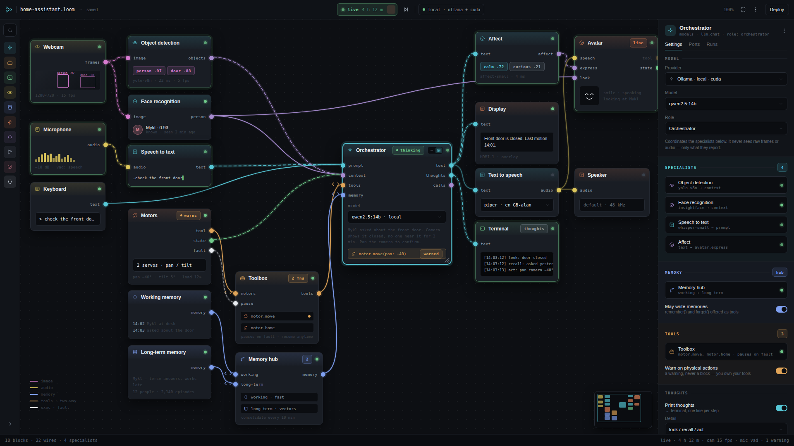

Eighteen blocks, twenty-two wires. Left to right:

| Wire | From | To | Type | Note |
| --- | --- | --- | --- | --- |
| 1 | Webcam `frames` | Object detection `image` | image | live |
| 2 | Webcam `frames` | Face recognition `image` | image | fan-out |
| 3 | Microphone `audio` | Speech to text `audio` | audio | live |
| 4 | Keyboard `text` | Orchestrator `prompt` | text | |
| 5 | Speech to text `text` | Orchestrator `prompt` | text | fan-in |
| 6 | Object detection `objects` | Orchestrator `context` | data | |
| 7 | Face recognition `person` | Orchestrator `context` | data | fan-in |
| 8 | Motors `tool` | Toolbox slot | tools | |
| 9 | Motors `state` | Orchestrator `context` | stream | telemetry |
| 10 | Motors `fault` | Toolbox `pause` | exec | interrupt |
| 11 | Toolbox `tools` | Orchestrator `tools` | tools | handle |
| 12 | Working memory `memory` | Memory hub slot 1 | memory | |
| 13 | Long-term memory `memory` | Memory hub slot 2 | memory | |
| 14 | Memory hub `memory` | Orchestrator `memory` | memory | handle |
| 15 | Orchestrator `text` | Display `text` | text | |
| 16 | Orchestrator `text` | Text to speech `text` | text | fan-out |
| 17 | Text to speech `audio` | Speaker `audio` | audio | |
| 18 | Orchestrator `thoughts` | Terminal `text` | text | prints thoughts |
| 19 | Orchestrator `text` | Affect `text` | text | fan-out |
| 20 | Affect `affect` | Avatar `express` | data | expression as a flow |
| 21 | Text to speech `audio` | Avatar `speech` | audio | lip sync; fan-out with the Speaker |
| 22 | Face recognition `person` | Avatar `look` | data | gaze |

What the example demonstrates:

- **Multiple specialist models working together.** Three perception
  models report into one orchestrator's `context`, and a fourth, Affect,
  reads the orchestrator's own words for the Avatar; the orchestrator never
  sees a frame. The inspector's Specialists section lists all four.
- **Working and long-term memory.** Two stores, one handle, consolidation
  every ten minutes, the orchestrator writing one line per episode.
- **Speaking, showing, thinking aloud.** `text` fans out to a display and
  a text-to-speech chain; `thoughts` goes to a terminal that prints one
  line per step (`look`, `recall`, `act`).
- **Acting on the world.** Motors are offered as a tool; a move warns
  first and then runs; the motors report position continuously and raise a
  fault that pauses the Toolbox.
- **A face.** The Avatar's mouth moves from the speech audio, its
  expression follows an Affect model reading the orchestrator's own words,
  and its gaze follows whoever face recognition sees. Its `tool` port is
  left unbound in this example: the model could call `face.express`
  directly, but here expression is a flow.

The narrative in the mockup: Mykl asks about the front door; the camera
shows it closed and empty for two minutes; the orchestrator decides to pan
the camera to confirm and calls `motor.move(pan: −40)` after a warning.

### 13.4 door_check — a custom block

Figures 10–13. A Python function with an `Image` parameter, a `float`
default and a `Data` return becomes a block with one input port, one
output port and a generated threshold slider. It is wired between a Webcam
and a Notify. When the function grows to 184 lines and gains a `Memory`
parameter, the block gains a `memory` port and stays summary-sized while
the code is edited in the drawer.

---

## 14. Consistency review

The artboards were reviewed against each other before this document was
written, and again after the Avatar and the view rule were added. Findings,
and what was done:

| # | Finding | Resolution |
| --- | --- | --- |
| 1 | Inspector second and third tabs varied by panel (Subscribers, Log, Browse, Events, People, Source) with no rule. | Standard tabs defined (§7.2). Mockups updated: every block panel reads Settings · Ports · Runs, sources read Settings · Ports · Events, block-specific tabs are appended. |
| 2 | The LLM on Figure 3 carried a *selected* chip; the orchestrator on Figure 9 did not. | Selection is the ring only. Chip removed. |
| 3 | The LLM's port set differed by screen (2, 3 or 4 inputs). | Canonical set defined and the hidden-optional-ports rule added (§4.5). Screens show the ports their example uses. |
| 4 | In the first draft, runtime blocks' tool ports were typed `stream` and `data`, so a Terminal could not legally reach `llm.tools`. | Runtime and actuator tool ports are typed `tools` (§6.3). Fixed in all screens. |
| 5 | Port labels overlaid block content in the first draft. | Blocks restructured with a port zone above the body (§3.1). |
| 6 | Toolbox input labels differed (terminal/python vs motors/pause). | Toolbox inputs are dynamic, one slot per connection, named after the connected block (§9.1). |
| 7 | Approval gates (*Require approval*, *awaiting ok*, *confirm?*, a Toolbox that *locks*) contradicted the no-blocking decision. | Relabelled as warnings throughout (§12). The Toolbox pauses and resumes. |
| 8 | The custom block's header chip read *custom* on one sheet, *reloaded* on another, *py* on a third. | The header carries the language chip; transient state chips (*reloaded*) show briefly beside it. Sheets updated. |
| 9 | Notify had a `send` (exec) input on one screen and a `text` input on another. | Both are canonical (§6.9); hidden-optional rule applies. |
| 10 | The Loop frame showed only `items`; the Loop panel listed four ports. | All four are canonical; the frame hides unwired outputs. |
| 11 | USB device appeared in the assistant graph in one revision and not the next. | Removed from the example for space; it remains in the library with its ports defined (§6.6). |
| 12 | Handle wires were visually identical to flow wires. | Two-way mark and heavier weight added (§4.3). |
| 13 | The Motors panel clipped its last field. | Panel height corrected. |
| 14 | *Deploy* sits on the top bar with no defined behaviour. | Defined as service and bundle (§15.1); screen is backlog. |
| 15 | The Avatar on Figure 9 shows an unwired `tool` port, which §4.5 says should be hidden. | Kept visible and dimmed on purpose, so the example shows both ways an expression can arrive. The rule stands; the mockup is the exception. |
| 16 | The view toggle, double-click and `⌘E` were specified for custom blocks only, while the Avatar needed the same gestures. | One rule for every block (§3.4); the shell, anatomy, gestures, keyboard and inspector sections now describe it once and the custom-block and Avatar sections refer to it. |
| 17 | Figures 9 and 16 are the same graph with one block in a different view. | Kept as two artboards: artboards on the design canvas share no state, so a view toggle cannot be shown live. The clickable prototype (Interactive) is where that would go. |

---

## 15. Decisions and backlog

The questions the draft left open, resolved at approval on 4 September
2026. *v1* means in the first build; *backlog* means designed later,
architecture kept open for it.

### 15.1 Deploy — backlog

Both forms: **run as a service** (the engine runs the graph headless,
starts with the machine, the shell attaches to it when opened) and
**export a bundle** (the graph, its custom blocks, rigs and a lockfile of
model and runtime versions, as one directory or archive that another
machine can run). The engine is a separate process from the first build
so the service form is the engine without the shell. The screen for
either is backlog.

### 15.2 Subgraphs — backlog, with a recommendation

`⌘G` collapses a selection into one block whose ports are the selection's
external ports. Recommendation to take into the backlog screen: the block
takes the Control category's slate with a nested-squares icon; its body
shows a miniature of the contents; double-clicking opens the subgraph as a
tab beside its parent, with a breadcrumb; it is stored inline in the
parent's `.loom`; *Save to library* puts it under Custom like a custom
block and turns the inline copy into a reference by path.

### 15.3 Graph file format — v1

`.loom` is one readable YAML file: strict subset, deterministic key
order, positions rounded to the grid, custom-block code embedded as block
scalars so diffs read as code. Subgraphs inline; library references by
relative path. A graph edited by hand and one edited on the canvas
produce the same file.

### 15.4 Remote models — v1

A per-graph **Local only** switch, on by default. Turning it off allows
remote model providers; the first send of a run to any remote service
warns (§12.2). The switch is shown on the graph panel and in the status
bar's runtime chip.

### 15.5 Wire transforms — resolved by removal

The *Transform* field in the first draft implied a mapping step living
on a wire, invisible on the canvas. That contradicts the grammar: a wire
matches or it does not. Removed. When a drag lands on a compatible-but-
not-identical pair (`data` to `text`, `stream` to `data`) the shell
offers to insert a **Convert** block on the wire; conversion is always a
visible block. Convert joins the Data category (backlog for its panel;
the insert-on-wire action is v1).

### 15.6 Multiple graphs — v1

A **workspace** is a folder. Open graphs are tabs across the top of the
canvas, one window. Subgraphs open as tabs beside their parent. The
library is per workspace.

### 15.7 Undo and history — v1 undo, backlog history

Undo and redo per graph, unlimited within a session, covering every
canvas edit including view and size changes. Autosave on every change.
Version history is delegated to git: when the workspace is a repository
the shell offers *Snapshots* (a commit on every run and on demand) and a
*Restore* list; that panel is backlog. The YAML format (§15.3) is what
makes this work.

### 15.8 Custom block languages — v1 Python, TypeScript/JavaScript, shell

JavaScript is covered: the TypeScript block kind runs plain `.js` too.
Rust and Go are backlog as a **compiled block**: a manifest pointing at a
built binary or shared library, no compile step in the shell. The value
is real for perception and actuator code that needs to be fast; the cost
is a toolchain the shell cannot manage. The engine is Rust, so a Rust
block can become an in-process plugin when it comes.

### 15.9 Touch and small screens — backlog

Desktop at 1560 px and above for v1. On small screens the deployed state
matters more than editing: a **Presence view** (the Avatar's stage plus
status and the run transport) is the small-screen face of a running
graph. Backlog, after Deploy.

### 15.10 Rig format — v1 SVG states, backlog editor and Rive

Reference format is a folder of SVG states with a `rig.yaml` manifest.
The four built-in rigs (Line, Robot, Orb, Pixel) ship in that format
with all seven expressions and their gestures, drawn from the mockups. A
rig editor and Rive import are in scope and on the backlog.

### 15.11 Platform

Linux first, CachyOS as the reference distribution; Wayland and X11.
Devices through the kernel's usual interfaces (V4L2 for cameras,
PipeWire for audio, `/dev/tty*` for serial). GPU acceleration for models
through the model runtime, not the shell.

### 15.12 Name

The product is **Cyberloom**, written as one word with a single capital.
Both halves are literal: cybernetics is the science of control and
communication through feedback, which is what the run modes, feedback
ports, senses and actuators build; the Jacquard loom was the first
programmable machine. Graph files are `.loom`, the engine daemon is
`loomd`, configuration lives in `~/.config/cyberloom/`, and the
application id is `dev.cyberloom.app`. In conversation the product
shortens to *Loom*; in writing and in every identifier it is Cyberloom.

### 15.13 Model provisioning — v1 network on first run

The engine may reach the network to fetch models: Ollama pulls, the
whisper and piper model files, the ONNX detector and affect classifier.
Shipping them in the installer would make it many gigabytes and freeze
the model choice at build time, so the download happens on demand.

The rules it works under:

- **Never silent.** A download is an explicit action with a visible
  destination, a size before it starts and a progress row in the status
  bar. Nothing is fetched because a graph happened to run.
- **Only weights.** The engine fetches model files and nothing else. It
  does not phone home, check for updates, or report usage.
- **Offline is a supported state.** With no network the app opens, edits,
  and runs every graph whose models are already present. A missing model
  is a clear message naming what is missing and where it would come from,
  never a crash and never a silent stall.
- **Local only is untouched.** §15.4 governs sending data to a remote
  model at run time and stays on by default. Fetching weights is setup;
  sending a prompt is not.
- **The bundle carries a lockfile.** Deploy (§15.1) records model and
  runtime versions so a bundle can be provisioned once and moved to a
  machine that never reaches the network.

---

## 16. Appendix

### 16.1 Colour tokens

| Token | Value | Use |
| --- | --- | --- |
| ground | `#08090b` | window background |
| canvas | `#0d0f13` | canvas with 22 px dot grid at 5.5 % white |
| panel | `#111419` | library, inspector, drawers |
| bar | `#0f1217` | top bar |
| block | `#191d24` | block body |
| field | `#0b0d11` | inputs, code, rows |
| line | `#242932` | borders |
| soft | `#1a1e25` | hairlines inside panels |
| text hi / mid / low / faint | `#e8ebf0` / `#98a2ae` / `#5f6875` / `#39414c` | |
| accent | `#56c7d6` | selection, primary action, active tab |
| ok / warn / err | `#6fc98a` / `#e0a458` / `#e0685f` | status |

Category colours: models `#56c7d6`, capabilities `#e0a458`, runtimes
`#6fc98a`, senses `#dcc65b`, memory `#7e9ff0`, actuators `#e8865a`, data
`#a78bd0`, control `#8a93a3`, human `#d97f8f`, custom `#c3ccd8`. Port type
colours are in §4.1.

### 16.2 Type

- **Space Grotesk** 400–700 for UI: block titles, panel titles, section
  headings, buttons, body copy in panels.
- **JetBrains Mono** 400–700 for anything technical: port names, values,
  commands, log lines, chips, category labels (uppercase, 0.12–0.17 em
  tracking).

Sizes on the reference frame: block title 12 px; port label 9.5 px; field
11.5 px; panel section label 9.5 px uppercase; console 10.5 px on 1.85
line height; code 10.5 px on 19 px lines.

### 16.3 Dimensions

| Element | Value |
| --- | --- |
| Reference frame | 1560 × 900; showcase 1920 × 1080 |
| Top bar / status bar | 46 / 28 px |
| Library / rail / inspector | 264 / 48 / 328 px |
| Console drawer / code drawer | 176 / 300 px |
| Block radius / header / port row | 9 / 31 / 24 px (header 24 px in Stage view) |
| Resize grip | 12 px, bottom-right |
| Avatar in Stage, default | 240 × 240 px, aspect locked |
| First port centre | 51 px from block top |
| Port dot / halo | 11 px / 3 px |
| Wire core / handle / halo | 1.9 / 2.2 / 5 px |
| Minimum block width | 168 px |
| Hit targets | ≥ 44 px on touch; 26–30 px controls on desktop |

### 16.4 Figures

| Figure | Artboard | Canvas page |
| --- | --- | --- |
| 1 | EmptyShell | Screens |
| 2 | BlockAnatomy | Screens |
| 3 | Main | Screens |
| 4 | Library | Screens |
| 5 | Inspector | Screens |
| 6 | SensePanels | Live and embodied |
| 7 | Running | Screens |
| 8 | Continuous | Live and embodied |
| 9 | Assistant | Live and embodied |
| 10 | CustomBlock | Custom blocks |
| 11 | CustomRules | Custom blocks |
| 12 | BlockViews | Custom blocks |
| 13 | CustomDrawer | Custom blocks |
| 14 | RunModes | Live and embodied |
| 15 | Avatar | Live and embodied |
| 16 | AssistantStage | Live and embodied |
| — | Interactive (clickable) | Clickable |

### 16.5 Files

```
design/cyberloom/
  SPEC.md            this document
  spec.html          the same, as a page with figures embedded (generated)
  build.mjs          generates every artboard from shared tokens
  build-spec.mjs     builds spec.html from SPEC.md and fig/
  *.dc.html          one artboard each
  canvas.json        artboard layout, pages, notes
  fig/*.png          rendered figures
  README.md          orientation
docs/
  PLAN.md            the build plan derived from this specification
```
